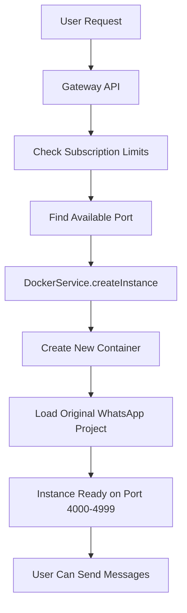

# 🚀 WhatsApp SaaS Gateway - Complete Multi-User Solution

<div align="center">
  
  
  
  
  
</div>

## 📋 نظرة عامة

**WhatsApp SaaS Gateway** هو نظام متكامل لإدارة WhatsApp متعدد المستخدمين مع:

- 🏗️ **بنية الخدمات المصغرة** - Gateway API + Session Auth + Docker Orchestration
- 🔐 **مصادقة متقدمة** - JWT tokens, API keys, subscription management
- 📊 **قاعدة بيانات شاملة** - PostgreSQL مع 9 جداول للمستخدمين والجلسات
- 🐳 **Docker Scaling** - إنشاء تلقائي لحاويات WhatsApp منفصلة
- 📱 **WhatsApp Integration** - يستخدم المشروع الأصلي بدون تعديل
- 🔄 **Auto-scaling** - توسع تلقائي حسب الحاجة والاشتراك

## 🏗️ الهيكل العام

```
whatsapp-api/
├── server.js                 # 📱 المشروع الأصلي (WhatsApp-web.js)
├── src/                      # 📁 API الأصلي (لم يتم المس به)
├── package.json              # 📦 dependencies الأصلية
└── gateway/                  # 🆕 نظام SaaS الجديد
    ├── api/                  # 🌐 Gateway API (port 3000)
    ├── session-auth/         # 🔐 Session Auth Service (port 3001)
    ├── database/             # 🗄️ PostgreSQL schemas
    ├── whatsapp-instance/    # 🐳 Docker instance wrapper
    ├── docker-compose.yml    # 🐳 All services
    └── README.md            # 📖 Complete documentation
```

## 🚀 نشر سريع على Ubuntu Server

### الطريقة الأولى: سكريبت تلقائي (موصى به)

```bash
# 1. استنساخ المشروع
git clone <your-repo-url>
cd whatsapp-api

# 2. تشغيل السكريبت التلقائي
./gateway/setup-ubuntu.sh

# 3. اتبع التعليمات على الشاشة
```

**السكريبت سيقوم بـ:**
- ✅ تثبيت جميع المتطلبات (Node.js, Docker, Nginx)
- ✅ إعداد قاعدة البيانات والكاش
- ✅ إنشاء SSL مجاني (اختياري)
- ✅ إعداد Firewall والأمان
- ✅ تشغيل النظام كاملاً
- ✅ إنشاء مستخدم تجريبي

### الطريقة الثانية: يدوياً

```bash
# 1. تثبيت المتطلبات
sudo apt update && sudo apt upgrade -y
sudo apt install -y curl git nodejs npm docker.io docker-compose nginx

# 2. إعداد المشروع
cd gateway
cp .env.example .env
nano .env  # عدّل الإعدادات

# 3. تشغيل الخدمات
docker-compose up -d

# 4. فحص الصحة
curl http://localhost:3000/health
```

## 🔧 كيف يعمل النظام

### 1. **Gateway API** (المدخل الرئيسي)
```bash
# تسجيل مستخدم جديد
curl -X POST http://localhost:3000/api/v1/auth/register \
  -H "Content-Type: application/json" \
  -d '{
    "email": "user@example.com",
    "password": "password123",
    "name": "Business User"
  }'

# تسجيل دخول
curl -X POST http://localhost:3000/api/v1/auth/login \
  -H "Content-Type: application/json" \
  -d '{
    "email": "user@example.com",
    "password": "password123"
  }'
```

### 2. **إنشاء جلسة WhatsApp**
```bash
curl -X POST http://localhost:3000/api/v1/sessions \
  -H "Authorization: Bearer YOUR_TOKEN" \
  -H "Content-Type: application/json" \
  -d '{
    "session_name": "my-business-whatsapp",
    "webhook_url": "https://your-webhook.com/whatsapp"
  }'
```

### 3. **تشغيل Instance (التوسع التلقائي)**
```bash
curl -X POST http://localhost:3000/api/v1/instances \
  -H "Authorization: Bearer YOUR_TOKEN" \
  -H "Content-Type: application/json" \
  -d '{
    "session_id": "your-session-id"
  }'
```

## 🐳 آلية Docker Scaling



**كل مستخدم يحصل على:**
- 🐳 حاويات Docker منفصلة
- 📱 WhatsApp instances مستقلة
- 🔒 عزل كامل للبيانات
- 📊 مراقبة شاملة

## 📊 المميزات الرئيسية

### 🏗️ Architecture
- **Microservices**: Gateway API, Session Auth, Docker Orchestration
- **Database**: PostgreSQL مع 9 جداول متخصصة
- **Caching**: Redis للأداء العالي
- **Load Balancing**: توزيع التحميل التلقائي

### 🔐 Security
- **JWT Authentication**: مصادقة آمنة
- **API Keys**: مفاتيح API مشفرة
- **Subscription Control**: تحكم في الحدود والموارد
- **SSL/TLS**: تشفير كامل

### 📈 Scaling
- **Horizontal**: عدة مستخدمين
- **Vertical**: عدة جلسات لكل مستخدم
- **Auto-scaling**: إنشاء تلقائي للحاويات
- **Resource Limits**: حدود CPU وذاكرة

### 📱 WhatsApp Integration
- **Zero Changes**: المشروع الأصلي بدون تعديل
- **Full API**: جميع مميزات whatsapp-web.js
- **QR Code**: مسح QR لكل جلسة
- **Webhooks**: إشعارات فورية

## 🛠️ إدارة النظام

### مراقبة الصحة
```bash
# فحص النظام
curl http://localhost:3000/health

# مشاهدة logs
docker-compose logs -f

# حالة الخدمات
docker-compose ps
```

### التحكم في الخدمات
```bash
# إيقاف/تشغيل
sudo systemctl stop whatsapp-saas
sudo systemctl start whatsapp-saas

# إعادة تشغيل خدمة معينة
docker-compose restart gateway_api
```

### النسخ الاحتياطية
```bash
# تلقائي يومياً في 2 صباحاً
# يمكنك تشغيل يدوياً:
/opt/whatsapp-saas/backup.sh
```

## 🌐 التوسع للإنتاج

### Single Server Setup
- **RAM**: 4GB دنيا، 8GB موصى به
- **CPU**: 2 cores دنيا، 4 cores موصى به
- **Storage**: 50GB للبيانات والجلسات
- **Network**: 100Mbps للاستخدام المتوسط

### Multi-Server Setup
- **Load Balancer**: Nginx/HAProxy
- **Database**: PostgreSQL Cluster
- **Redis**: Redis Cluster
- **Container Registry**: Docker Hub/ECR

## 📚 الدعم والتوثيق

### ملفات مهمة
- `gateway/README.md` - دليل تفصيلي
- `gateway/QUICK_START.md` - البدء السريع
- `gateway/UBUNTU_DEPLOYMENT.md` - نشر Ubuntu
- `gateway/INSTALLATION_SUMMARY.md` - ملخص التثبيت

### APIs
- **Gateway API**: http://localhost:3000/api-docs
- **Session Auth**: http://localhost:3001/api-docs
- **Health Check**: http://localhost:3000/health

## 🤝 المساهمة

المشروع مفتوح المصدر ونرحب بالمساهمات:

1. Fork المشروع
2. إنشاء branch جديد
3. تطوير الميزة
4. إرسال Pull Request

## 📝 الترخيص

هذا المشروع مرخص تحت MIT License.

## 🏆 الخلاصة

**WhatsApp SaaS Gateway** هو حل متكامل لإدارة WhatsApp التجارية مع:

✅ **توسع تلقائي** - Docker containers لكل مستخدم  
✅ **أمان متقدم** - JWT، API keys، subscription control  
✅ **إدارة سهلة** - واجهة API شاملة  
✅ **مراقبة متقدمة** - Health checks، logs، analytics  
✅ **نشر بسيط** - Ubuntu setup script  

**🚀 جاهز للإنتاج والاستخدام التجاري!**

---

<div align="center">
  <strong>Made with ❤️ for the WhatsApp Business Community</strong>
</div>
