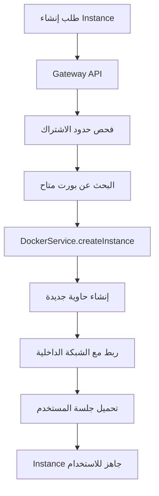

# 🚀 دليل البدء السريع - WhatsApp SaaS Gateway

هذا دليل شامل لتشغيل واستخدام **نظام WhatsApp SaaS Gateway** بالكامل.

## 📋 قبل البدء

### ✅ المتطلبات

```bash
# تأكد من تثبيت المتطلبات
node --version    # >= 18.0.0
docker --version  # >= 20.0.0
docker-compose --version  # >= 2.0.0
```

### 🗂️ هيكل المشروع

```
whatsapp-api/
├── server.js         # 📁 المشروع الأصلي (لم يتم المس به)
├── src/              # 📁 WhatsApp-web.js API الأصلي
├── package.json      
└── gateway/          # 🆕 النظام الجديد
    ├── docker-compose.yml     # تشغيل الخدمات
    ├── .env.example          # إعدادات البيئة
    └── api/                  # Gateway API
    └── whatsapp-instance/    # حاويات WhatsApp
    └── database/             # قاعدة البيانات
```

## 🎯 الخطوة 1: تحضير البيئة

### 1.1 إعداد متغيرات البيئة

```bash
cd gateway
cp .env.example .env

# عدّل الملف حسب حاجتك
nano .env
```

### 1.2 محتوى ملف `.env` الأساسي:

```env
# Database
DB_HOST=postgres
DB_PORT=5432
DB_NAME=whatsapp_saas
DB_USER=postgres
DB_PASSWORD=postgres123

# JWT
JWT_SECRET=your-super-secret-key-change-this

# Ports for instances
INSTANCE_PORT_RANGE_START=4000
INSTANCE_PORT_RANGE_END=4100

# Docker
DOCKER_HOST=unix:///var/run/docker.sock
WHATSAPP_IMAGE=whatsapp-instance:latest
```

## 🚀 الخطوة 2: تشغيل النظام

### 2.1 بناء وتشغيل الخدمات

```bash
# من مجلد gateway/
docker-compose up --build -d

# متابعة العمليات
docker-compose logs -f
```

### 2.2 التحقق من تشغيل الخدمات

```bash
# فحص الخدمات
curl http://localhost:3000/health

# يجب أن ترى:
{
  "status": "healthy",
  "services": {
    "database": "connected",
    "redis": "connected"
  }
}
```

## 👤 الخطوة 3: إنشاء حساب مستخدم

### 3.1 تسجيل مستخدم جديد

```bash
curl -X POST http://localhost:3000/api/v1/auth/register \
  -H "Content-Type: application/json" \
  -d '{
    "email": "test@example.com",
    "password": "password123",
    "name": "Test User",
    "phone": "+1234567890"
  }'
```

### 3.2 تسجيل الدخول والحصول على Token

```bash
curl -X POST http://localhost:3000/api/v1/auth/login \
  -H "Content-Type: application/json" \
  -d '{
    "email": "test@example.com",
    "password": "password123"
  }'

# احفظ الـ token من الاستجابة
TOKEN="eyJhbGciOiJIUzI1NiIsInR5cCI6IkpXVCJ9..."
```

## 📱 الخطوة 4: إنشاء جلسة WhatsApp

### 4.1 إنشاء جلسة جديدة

```bash
curl -X POST http://localhost:3000/api/v1/sessions \
  -H "Authorization: Bearer $TOKEN" \
  -H "Content-Type: application/json" \
  -d '{
    "session_name": "my-business-whatsapp",
    "webhook_url": "https://your-webhook-url.com/webhook",
    "settings": {
      "auto_reply": false,
      "webhook_events": ["message", "status"]
    }
  }'

# احفظ session_id من الاستجابة
SESSION_ID="uuid-from-response"
```

### 4.2 عرض الجلسات

```bash
curl -X GET http://localhost:3000/api/v1/sessions \
  -H "Authorization: Bearer $TOKEN"
```

## 🐳 الخطوة 5: تشغيل Instance (التوسع التلقائي!)

### 5.1 تشغيل حاوية WhatsApp لجلسة

```bash
curl -X POST http://localhost:3000/api/v1/instances \
  -H "Authorization: Bearer $TOKEN" \
  -H "Content-Type: application/json" \
  -d '{
    "session_id": "'$SESSION_ID'"
  }'

# ستحصل على:
{
  "success": true,
  "message": "Instance is starting",
  "data": {
    "instance": {
      "id": "instance-uuid",
      "container_name": "whatsapp_user123_my-business-whatsapp",
      "port": 4000,
      "status": "starting"
    }
  }
}
```

### 5.2 مراقبة حالة Instance

```bash
# عرض جميع instances
curl -X GET http://localhost:3000/api/v1/instances \
  -H "Authorization: Bearer $TOKEN"

# عرض instance محدد
curl -X GET http://localhost:3000/api/v1/instances/INSTANCE_ID \
  -H "Authorization: Bearer $TOKEN"
```

## 📲 الخطوة 6: ربط WhatsApp والإرسال

### 6.1 الحصول على QR Code (في المحاكي)

الآن ستحتاج لمسح QR code من logs الحاوية:

```bash
# عرض logs الحاوية
curl -X GET http://localhost:3000/api/v1/instances/INSTANCE_ID/logs \
  -H "Authorization: Bearer $TOKEN"

# أو مباشرة من Docker
docker logs whatsapp_user123_my-business-whatsapp
```

### 6.2 إرسال رسالة

```bash
# بعد أن تصبح الحالة "running"
curl -X POST http://localhost:3000/api/v1/messages/send \
  -H "Authorization: Bearer $TOKEN" \
  -H "Content-Type: application/json" \
  -d '{
    "session_id": "'$SESSION_ID'",
    "recipient": "1234567890@c.us",
    "message": "🎉 مرحباً من نظام WhatsApp SaaS!",
    "message_type": "text"
  }'
```

## 📊 الخطوة 7: مراقبة النظام

### 7.1 عرض الإحصائيات

```bash
# إحصائيات عامة
curl -X GET http://localhost:3000/api/v1/analytics/overview \
  -H "Authorization: Bearer $TOKEN"

# حالة النظام
curl -X GET http://localhost:3000/health
```

### 7.2 عرض سجل الرسائل

```bash
curl -X GET http://localhost:3000/api/v1/messages \
  -H "Authorization: Bearer $TOKEN"
```

## 🚀 التوسع التلقائي - كيف يحدث؟

### 🔄 آلية التوسع



### 📈 أمثلة التوسع

```bash
# يمكن للمستخدم الواحد تشغيل عدة instances (حسب الاشتراك)
# مثال: 3 جلسات مختلفة للأعمال

# Instance 1 - خدمة العملاء
curl -X POST http://localhost:3000/api/v1/instances \
  -H "Authorization: Bearer $TOKEN" \
  -d '{"session_id": "customer-service-session"}'

# Instance 2 - التسويق  
curl -X POST http://localhost:3000/api/v1/instances \
  -H "Authorization: Bearer $TOKEN" \
  -d '{"session_id": "marketing-session"}'

# Instance 3 - المبيعات
curl -X POST http://localhost:3000/api/v1/instances \
  -H "Authorization: Bearer $TOKEN" \
  -d '{"session_id": "sales-session"}'
```

## 🎛️ إدارة متقدمة

### إيقاف Instance

```bash
curl -X POST http://localhost:3000/api/v1/instances/INSTANCE_ID/stop \
  -H "Authorization: Bearer $TOKEN"
```

### إعادة تشغيل Instance

```bash
curl -X POST http://localhost:3000/api/v1/instances/INSTANCE_ID/restart \
  -H "Authorization: Bearer $TOKEN"
```

### حذف Instance

```bash
curl -X DELETE http://localhost:3000/api/v1/instances/INSTANCE_ID \
  -H "Authorization: Bearer $TOKEN"
```

## 🔗 استخدام مع المشروع الأصلي

### كيف يتم الربط:

1. **المشروع الأصلي** (`server.js` + `src/`) يبقى كما هو
2. **حاويات WhatsApp** تستخدم المشروع الأصلي + wrapper للتحكم
3. **Gateway** يدير الحاويات ويوزع الطلبات
4. **كل مستخدم** يحصل على حاويات منفصلة لجلساته

### مثال: ربط webhook من المشروع الأصلي

```javascript
// في instance-wrapper.js (داخل كل حاوية)
const originalApp = require('./src/app') // المشروع الأصلي

// ربط events من whatsapp-web.js مع Gateway
client.on('qr', (qr) => {
  // إرسال QR للـ Gateway
  sendWebhook('qr', { qr_code: qr })
})

client.on('message', (message) => {
  // تسجيل الرسالة في Gateway
  sendWebhook('message', { message })
})
```

## 📝 مثال شامل - سكريبت Node.js

```javascript
// test-system.js
const axios = require('axios')

const API_BASE = 'http://localhost:3000/api/v1'
let authToken = ''

async function fullTest() {
  try {
    // 1. تسجيل دخول
    console.log('🔐 تسجيل الدخول...')
    const loginRes = await axios.post(`${API_BASE}/auth/login`, {
      email: 'demo@whatsapp-saas.com',
      password: 'demo123'
    })
    authToken = loginRes.data.data.token
    console.log('✅ تم تسجيل الدخول')

    // 2. إنشاء جلسة
    console.log('📱 إنشاء جلسة WhatsApp...')
    const sessionRes = await axios.post(`${API_BASE}/sessions`, {
      session_name: 'test-session-' + Date.now(),
      webhook_url: 'https://webhook.site/unique-id'
    }, {
      headers: { Authorization: `Bearer ${authToken}` }
    })
    const sessionId = sessionRes.data.data.session.id
    console.log('✅ تم إنشاء الجلسة:', sessionId)

    // 3. تشغيل Instance
    console.log('🐳 تشغيل Instance...')
    const instanceRes = await axios.post(`${API_BASE}/instances`, {
      session_id: sessionId
    }, {
      headers: { Authorization: `Bearer ${authToken}` }
    })
    const instanceId = instanceRes.data.data.instance.id
    console.log('✅ تم تشغيل Instance:', instanceId)

    // 4. انتظار تشغيل Instance
    console.log('⏳ انتظار Instance للاستعداد...')
    let ready = false
    for (let i = 0; i < 30; i++) {
      await new Promise(resolve => setTimeout(resolve, 2000))
      
      const statusRes = await axios.get(`${API_BASE}/instances/${instanceId}`, {
        headers: { Authorization: `Bearer ${authToken}` }
      })
      
      if (statusRes.data.data.instance.status === 'running') {
        ready = true
        break
      }
      console.log(`⏳ حالة Instance: ${statusRes.data.data.instance.status}`)
    }

    if (!ready) {
      throw new Error('Instance لم يصبح جاهزاً')
    }

    // 5. إرسال رسالة تجريبية
    console.log('📤 إرسال رسالة تجريبية...')
    const messageRes = await axios.post(`${API_BASE}/messages/send`, {
      session_id: sessionId,
      recipient: '1234567890@c.us',
      message: '🎉 تم تشغيل النظام بنجاح!'
    }, {
      headers: { Authorization: `Bearer ${authToken}` }
    })
    console.log('✅ تم إرسال الرسالة')

    // 6. عرض الإحصائيات
    const statsRes = await axios.get(`${API_BASE}/analytics/overview`, {
      headers: { Authorization: `Bearer ${authToken}` }
    })
    console.log('📊 إحصائيات النظام:', statsRes.data.data.overview)

    console.log('🎉 تم اختبار النظام بنجاح!')

  } catch (error) {
    console.error('❌ خطأ:', error.response?.data || error.message)
  }
}

fullTest()
```

## 🛟 استكشاف الأخطاء

### مشاكل شائعة وحلولها:

#### 1. فشل في تشغيل Docker

```bash
# تأكد من تشغيل Docker
sudo systemctl start docker

# تأكد من الصلاحيات
sudo usermod -aG docker $USER
```

#### 2. بورت مستخدم

```bash
# فحص البورت
sudo netstat -tulpn | grep :3000

# تغيير البورت في .env
PORT=3001
```

#### 3. فشل الاتصال بقاعدة البيانات

```bash
# إعادة تشغيل قاعدة البيانات
docker-compose restart postgres

# فحص logs
docker-compose logs postgres
```

#### 4. Instance لا يبدأ

```bash
# فحص logs الحاوية
curl -X GET http://localhost:3000/api/v1/instances/INSTANCE_ID/logs \
  -H "Authorization: Bearer $TOKEN"

# فحص موارد النظام
docker system df
```

## 🎯 الخلاصة

تم الآن **تشغيل نظام WhatsApp SaaS كامل** يتضمن:

✅ **Gateway API** - إدارة المستخدمين والاشتراكات  
✅ **Docker Orchestration** - توسع تلقائي للحاويات  
✅ **WhatsApp Integration** - ربط مع المشروع الأصلي  
✅ **Multi-tenancy** - عزل كامل بين المستخدمين  
✅ **Monitoring & Analytics** - مراقبة شاملة  

**🚀 النظام جاهز للإنتاج والتوسع!**